# Hospital Management System

## This is a Fullstack Hospital Management System project built using the MERN stack, with three distinct user roles: User, Doctor, and Admin.

1. **User Features**:
   Users can register or log in to explore the list of available doctors by their specializations. They can easily book appointments, make payments online through Stripe, and view all upcoming and past appointments. Users can also update their personal information in the "My Profile" section.

2. **Doctor Features**:
   Doctors can log in to view and manage their appointments and update their profiles. Through their personalized dashboard, they can track total earnings, the number of appointments, and patient interactions. Doctors have the option to complete or cancel appointments directly from their dashboard, enabling efficient appointment management.

3. **Admin Features**:
   The admin can log in to oversee all aspects of the system. They have access to an Admin Dashboard that displays the total number of doctors, patients, and booked appointments. Additionally, the admin can view recent appointments and manage doctor profiles and their schedules, streamlining the system's functionality.

_This project demonstrates a comprehensive hospital management solution, supporting an intuitive user experience, robust role-specific features, and secure online payments, providing seamless interaction for patients, doctors, and administrators._

**Live Preview** : https://mediconnect-frontend-psi.vercel.app/
 
 
**Admin/Doctor Portal** : https://mediconnect-admin-zeta.vercel.app/

## Here are some references images

## User Sction

### User Registration & Login

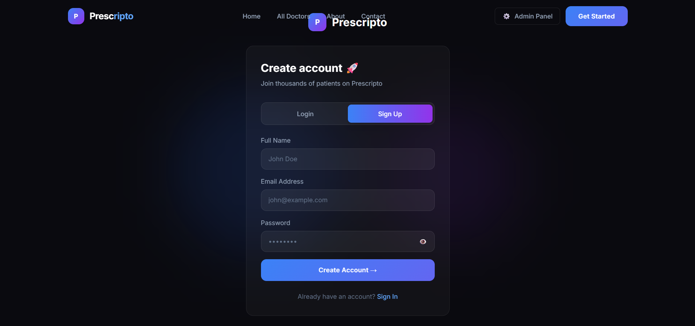

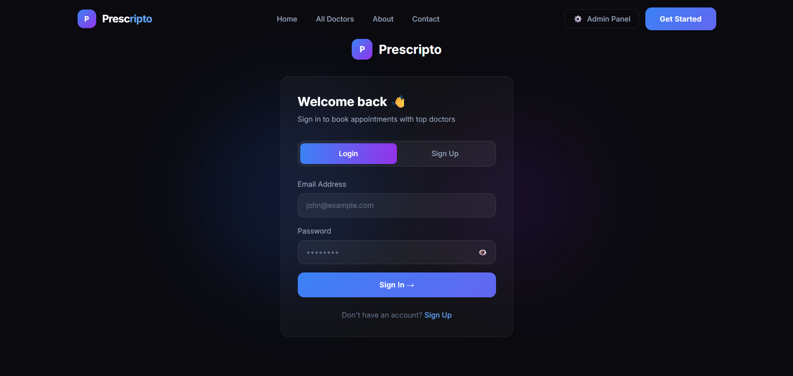

### Home Screen

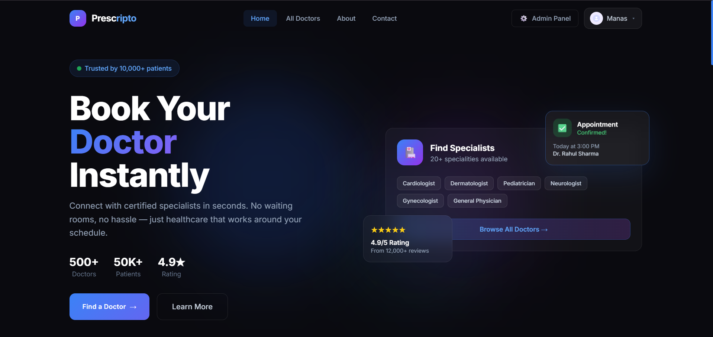

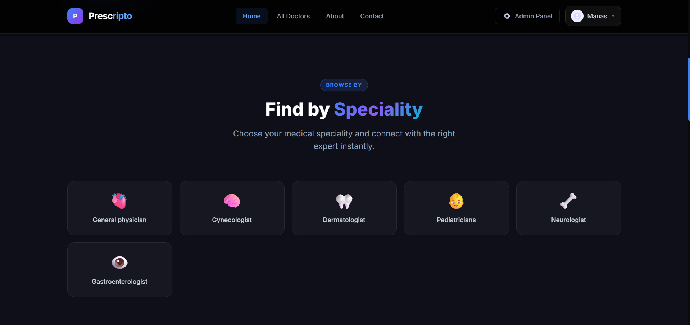

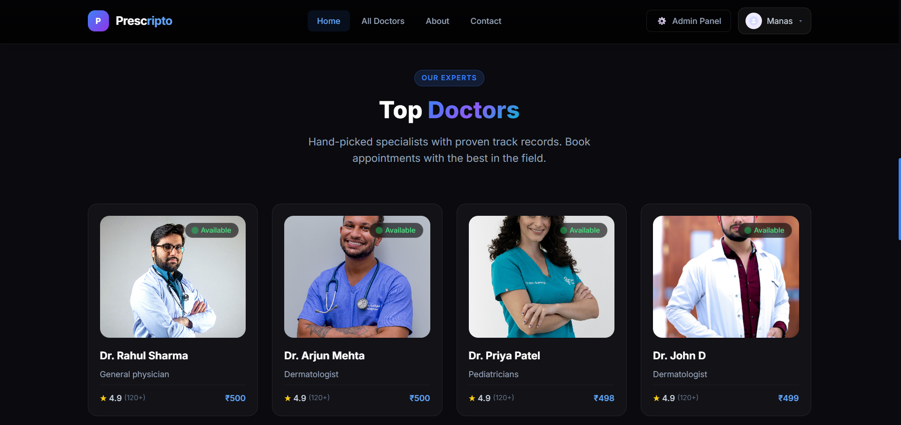

### All Doctors Page

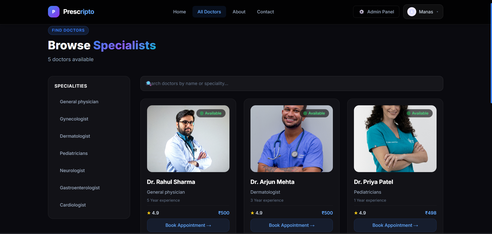

### About Us

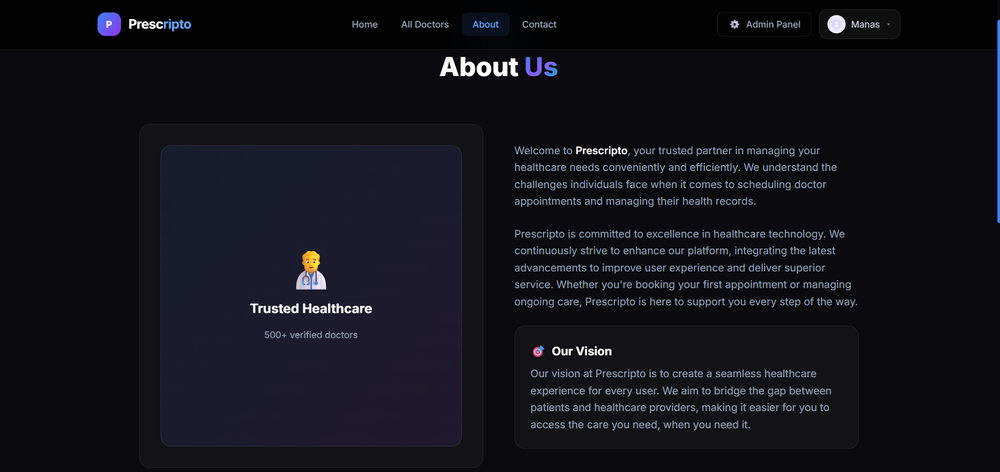

### Contact Information

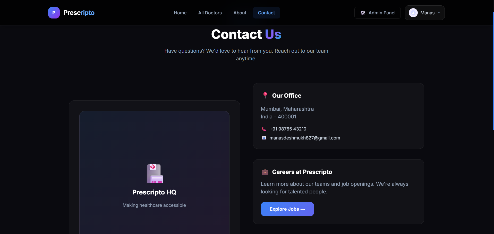

## Admin Section

### Admin Login

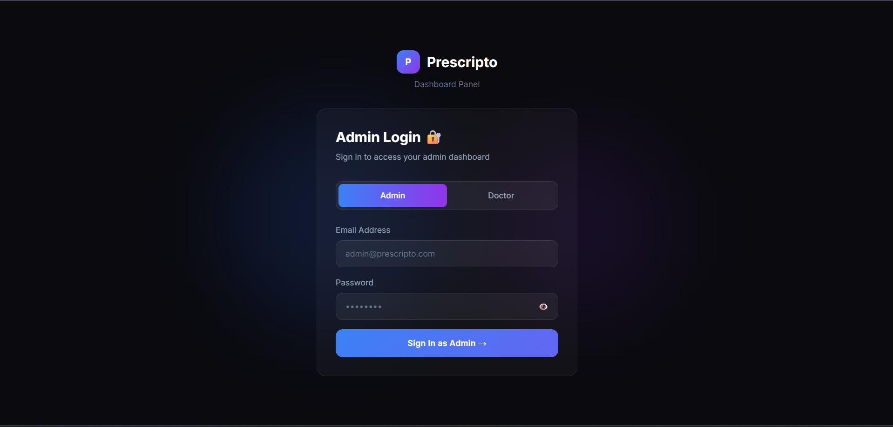

### Admin Dashboard

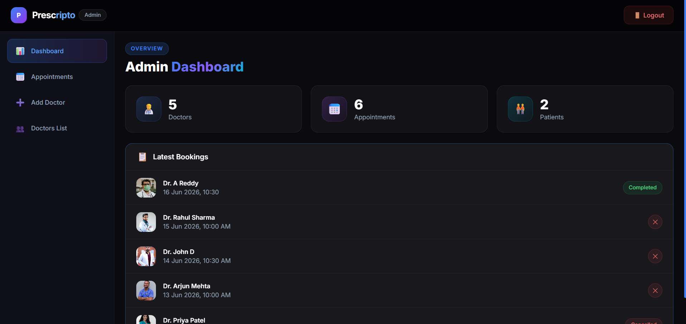

### All Appointments

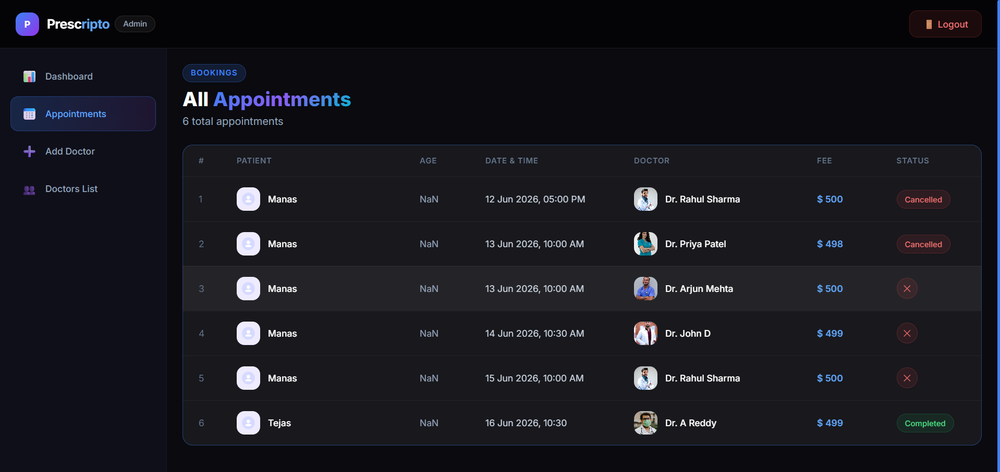

### Add Doctor Form

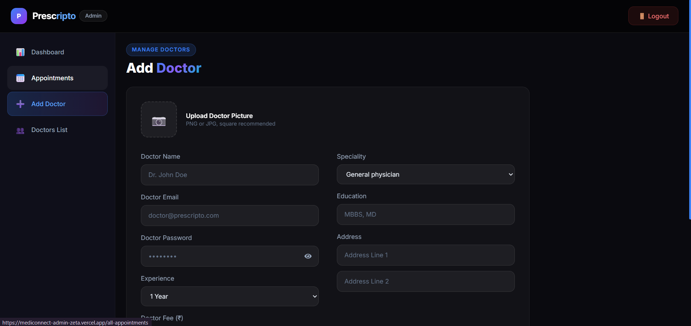

### All Doctor

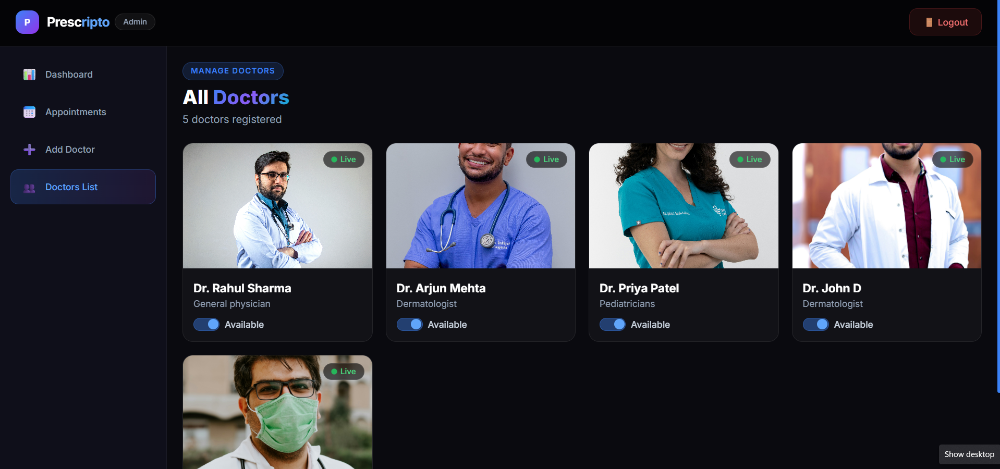

### Thank You for Visiting 🙏
